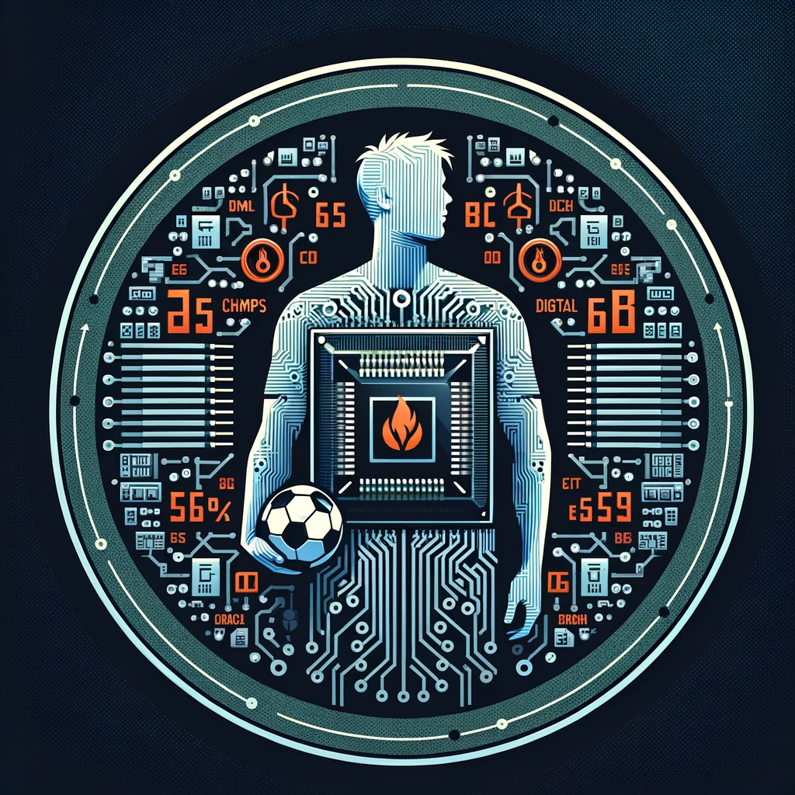

# MESSY (Multi-layer Extra-functional Simulator in Systemc)



The availability of simulation platforms is a key ingredient for making RISC-V based hardware solutions pervasive. Simulators represent a cost-effective and scalable solution that enable rapid prototyping without the need for physical hardware. For these reasons, there is a growing availability of programs designed to simulate entire RISC-V chips. Some options include QEMU, Simulink, Renode, and GVSoC. However, these tools present some limitations. Most of them only simulate the computing core with scarce possibilities to perform system-level simulations. Moreover, they simulate only functional features, with poor support for extra-functional properties such as power consumption. This work tries to address these challenges by presenting a flexible simulator.

Messy is an open-source framework that integrates functional RISC-V simulation (achieved with GVSoC) with SystemC-AMS (used to model extra-functional aspects, in detail power storage and distribution). The combination of GVSoC and SystemC-AMS in a single simulation framework allows to perform a DSE that is dependent on the mutual impact between functional and extra-functional aspects. 

# Reference

If you enjoy and use Messy on your works, please acknowledge our paper: https://dl.acm.org/doi/10.1145/3637543.3652873
```
@inproceedings{10.1145/3637543.3652873,
      author = {Hamdi, Mohamed Amine and Pollo, Giovanni and Risso, Matteo and Haugou, Germain and Burrello, Alessio and Macii, Enrico and Poncino, Massimo and Vinco, Sara and Pagliari, Daniele Jahier},
      title = {Integrating SystemC-AMS Power Modeling with a RISC-V ISS for Virtual Prototyping of Battery-operated Embedded Devices},
      year = {2024},
      isbn = {9798400704925},
      url = {https://doi.org/10.1145/3637543.3652873},
      doi = {10.1145/3637543.3652873},
      booktitle = {Proceedings of the 21st ACM International Conference on Computing Frontiers: Workshops and Special Sessions},
      keywords = {Design Space Exploration, Power, RISC-V, SystemC, Virtual Prototyping},
}
```

# Documentation

To get started, please refer to the [Documentation](https://eml-eda.github.io/messy/)
