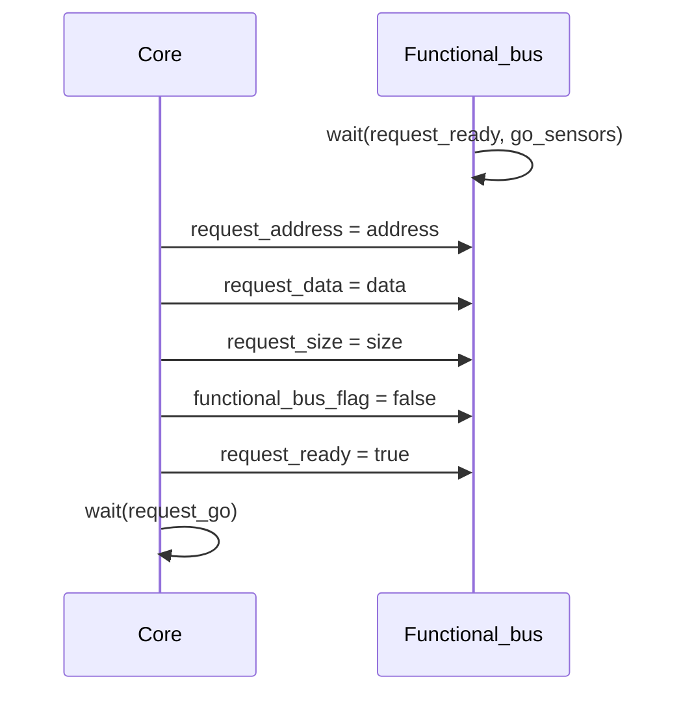
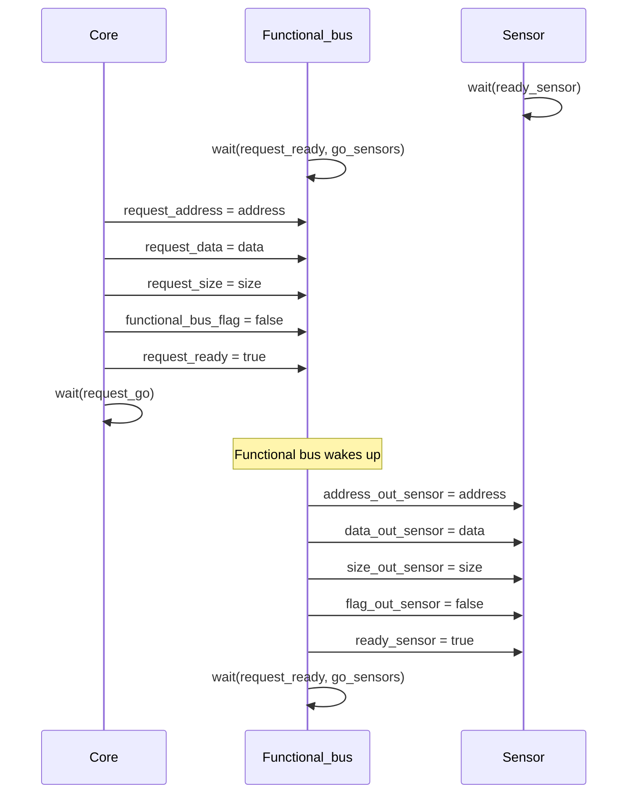
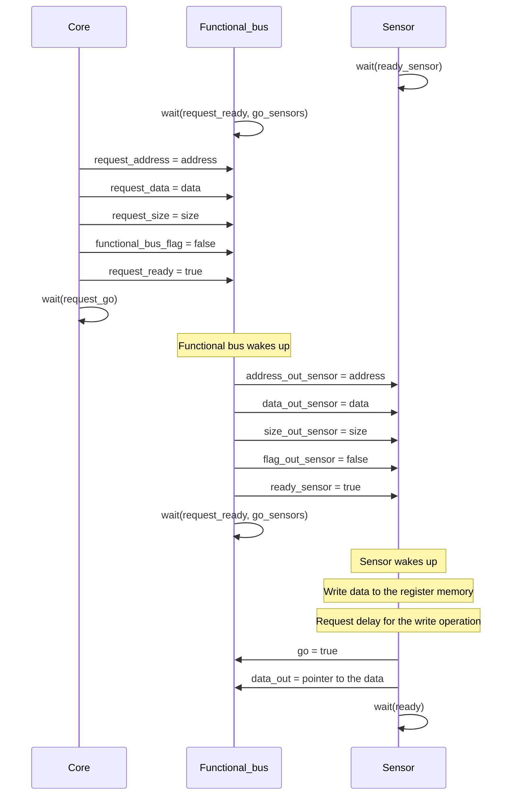
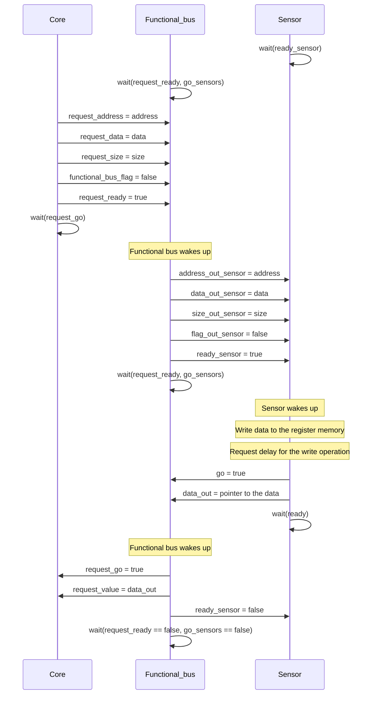
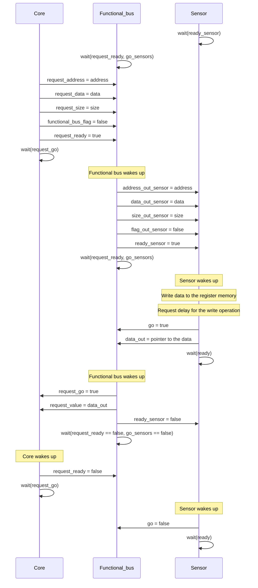
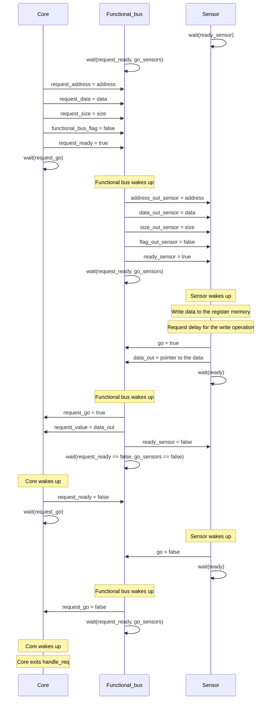

This file is intended for giving a full example of how the communication between the different modules works. It will mainly focus on the SystemC components. To have more details about the communication of GvSoC with SystemC, please refer to the [timing](timing.md) documentation.

The whole system works by means of requests, that can be of two types:

- **Read**: the core wants to read data from a sensor
- **Write**: the core wants to write data to a sensor

When a request is made, the [text](core.md) need to set the corrected values to its output signals, to instruct the functional bus how to handle the request. The following code snippet shows how the core handles the request.

``` cpp
void Core::handle_req(MessyRequest *req)
{
    // ... other code
    if (req->read_req)
    {
        // setting the correct signals to the functional bus for a read request
    }
    else
    {
        // // setting the correct signals to the functional bus for a write request
    }
    // ... other code
}
```
For all the details on the function `handle_req` please refer to the [core.cpp](https://github.com/eml-eda/messy/blob/main/messy/codegen/templates/src/core.cpp) file.

The middle main component of the system is the [functional bus](functional-bus.md). 

## Write Request

### Core
When a write request is made, the [core](core.md) sets the following signals:

- **request_address**: is set to the address of the sensor memory that is being accessed
- **request_data**: is set to the pointer to the data that is being written to the sensor memory
- **request_size**: is set to the number of bytes that are being written to the sensor memory
- **functional_bus_flag**: is set to false, to indicate that the request is a write
- **request_ready**: is set to true, to indicate that the request is ready to be processed by the functional bus

Then the [core](core.md) stops on a `wait()` statement, waiting for a change on the `request_go` signal. A visual representation of the sequence of events of this first part is shown in the following diagram.



### Functional Bus

The context is then passed to the [functional bus](functional-bus.md), which is waiting on the hilighted `wait()` statement in the following code.

``` cpp hl_lines="9"
void Functional_bus::processing_data(){
    // ..... other code
    while (true){
        if (request_ready.read() == true) {
            // ... other code
        }
        
        // Wait for the next event
        wait();

        if(selected_sensor>=0){
            // ... other code
        }
 
    }
}    
```

Since the `request_ready` signal, which was initially set to false, is now set to true, the [functional bus](functional-bus.md) wakes up and starts processing the request. 
The first thing that the [functional bus](functional-bus.md) does is to set the `request_go` signal to 0, to indicate that the request is being processed. Then it continues by setting all the necessary signals to instruct the sensor how to handle the request. Specifically, it sets the following signals:

- **address_out_sensor**: is set to the address of the sensor memory that is being accessed
- **data_out_sensor**: is set to the pointer to the data that is being written to the sensor memory
- **size_out_sensor**: is set to the number of bytes that are being written to the sensor memory
- **flag_out_sensor**: is set to false, to indicate that the request is a write
- **ready_sensor**: is set to true, to indicate that the sensor can start processing the request

After that, the [functional bus](functional-bus.md) stops again on the same `wait()` statement as before, waiting for the sensor to complete the request. 



### Sensor
The context, is then passed to the sensor, which wakes up and executes the write request. Inside the sensor, the size of the request is read and then the data is written to the sensor memory. Additionally the sensor requests a delay to the [core](core.md) to simulate the time it takes to write the data.

The following code snippet shows how the sensor handles the request.

``` cpp

void Sensor_mic_click_functional::sensor_logic() {
    while (true) {
        if (enable.read() == true) {
            if (ready.read() == true) {
                // ... other code
            } else {
                // Write data to the register memory
                for (unsigned int i = 0; i < req_size_val; i++)
                    register_memory[i + add] = req_core_val_addr[i];
             
                // Request delay for the write operation
                double start_time = sc_time_stamp().to_double(); ///< Get the current simulation time
                core->request_delay(start_time, 30, SIM_RESOLUTION); 
            }
```

When the sensor has completed the write request, it sets the `go` signal to true, to indicate that the request has been completed. Additionally, it also set the power consumption of the write state, that is used by the power instance of the sensor to calculate the power consumption. Finally, the sensor stops on a `wait()` statement, waiting for a change on the `ready` signal. 

This change in the `go` signal, which was previously set to false, wakes up the [functional bus](functional-bus.md). 



### Functional Bus

The [functional bus](functional-bus.md) wakes up, sets the `request_go` signal to true, to indicate that the request has been completed. Additionally it sets the `ready_sensor` signal to false, to indicate that the sensor has completed the request and the `request_value` to the output of the sensors. Finally, the [functional bus](functional-bus.md) stops on a `wait()` statement, waiting for both the `request_go` and the `go_sensors` signals to become false. 

The following code snippet shows where the [functional bus](functional-bus.md) stops on the `wait()` statement.

``` cpp hl_lines="11"
void Functional_bus::processing_data(){
    while (true){
        // ... other code

        if(selected_sensor>=0){
            // Check if a valid sensor was selected
            response();
            
            // Wait until the sensor and request are no longer ready
            while (go_sensors[selected_sensor].read() != false && request_ready.read() != false) {
                wait();
            }
            // Indicate that the request processing is complete
            request_go.write(false);
        }
    }
}
```




### Sensor & Core

The context is then switched to the core and to the sensor. Thanks to a change on the `request_go` the core wakes up and sets the `request_ready` signal to false, to indicate that the request has been completed. The sensor, instead, is woke up by a change on the `ready` signal, and sets the `go` signal to false, to indicate that the request has been completed also on its side.




### Functional Bus & Core

Finally, thanks to both the signal `request_ready` and `go_sensors` being false, the [functional bus](functional-bus.md) wakes up and sets the `request_go` signal to false, to indicate that the request is completed. The [functional bus](functional-bus.md) then stops on the `wait()` statement, waiting for the next request.
On the other side, the [core](core.md) wakes up due to a change on the `request_go` signal, and exits the `handle_req` function. When a new re



As you can see, the final situation of the system is the same as the initial one. The system is ready to handle a new request.


## Read Request