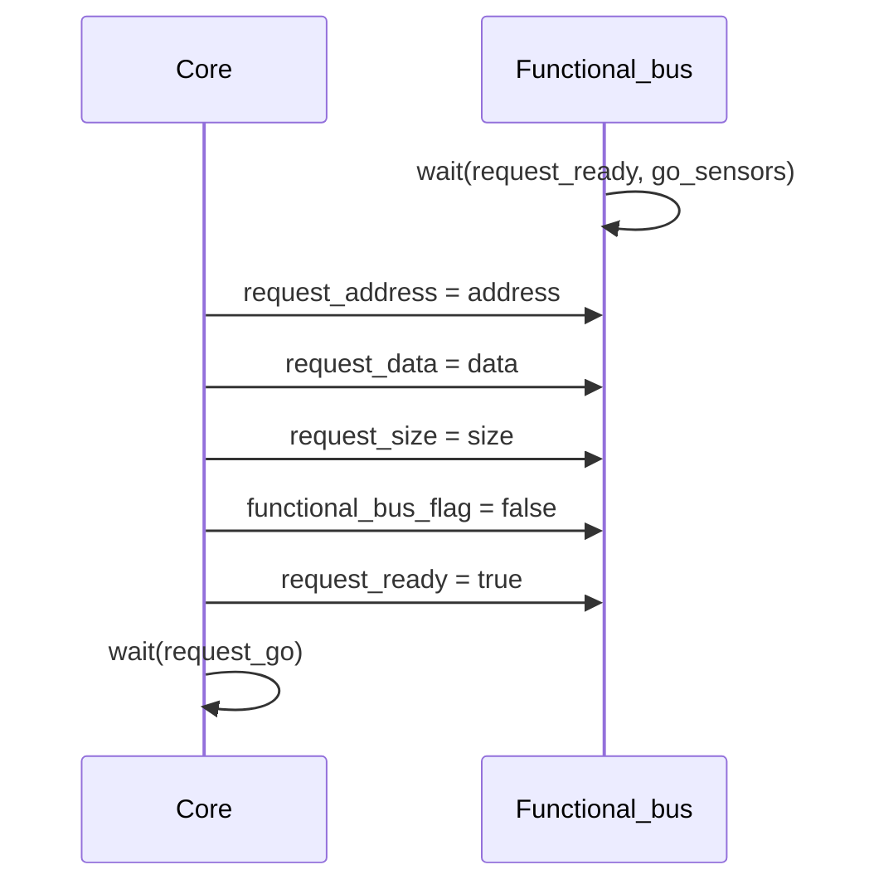
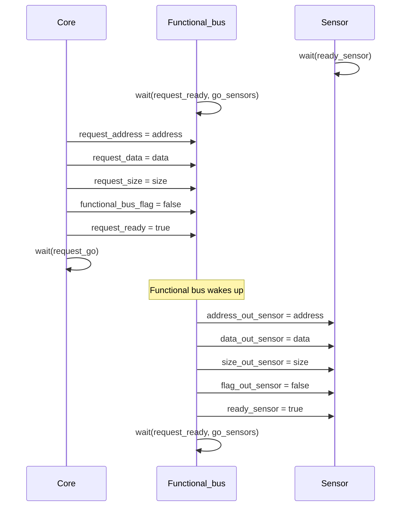
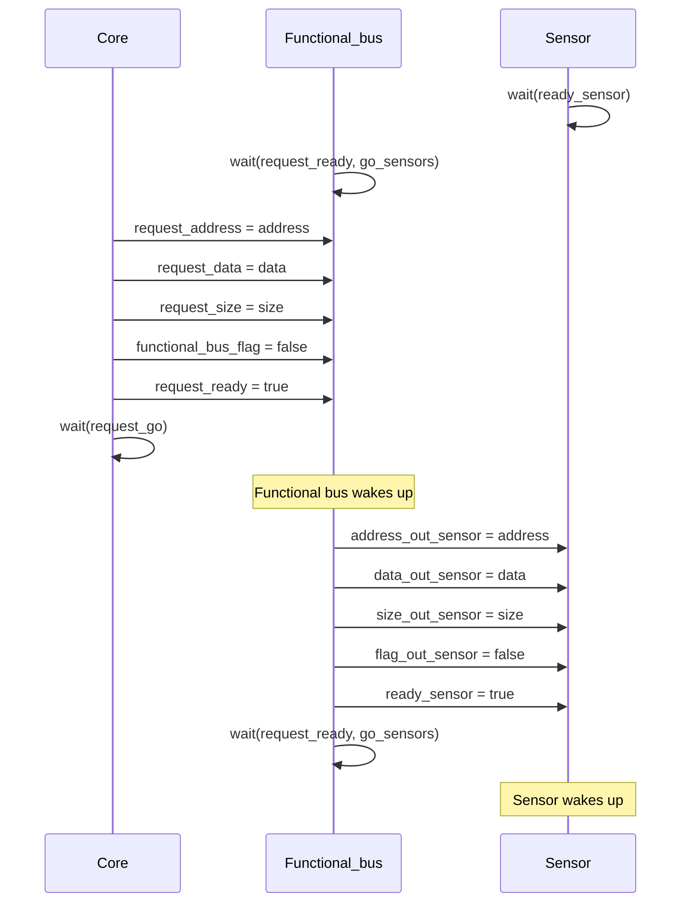

This file is intended for giving a full example of how the communication between the different modules works. It will mainly focus on the SystemC components. To have more details about the communication of GvSoC with SystemC, please refer to the [timing](timing.md) documentation.

The whole system works by means of requests, that can be of two types:

- **Read**: the core wants to read data from a sensor
- **Write**: the core wants to write data to a sensor

When a request is made, the [text](core.md) need to set the corrected values to its output signals, to instruct the functional bus how to handle the request. The following code snippet shows how the core handles the request.

``` cpp
void Core::handle_req(MessyRequest *req)
{
    // ... other code
    if (req->read_req)
    {
        // setting the correct signals to the functional bus for a read request
    }
    else
    {
        // // setting the correct signals to the functional bus for a write request
    }
    // ... other code
}
```
For all the details on the function `handle_req` please refer to the [core.cpp](https://github.com/eml-eda/messy/blob/main/messy/codegen/templates/src/core.cpp) file.

The middle main component of the system is the [functional bus](functional-bus.md). 

## Write Request

When a write request is made, the [core](core.md) sets the following signals:

- **request_address**: is set to the address of the sensor memory that is being accessed
- **request_data**: is set to the pointer to the data that is being written to the sensor memory
- **request_size**: is set to the number of bytes that are being written to the sensor memory
- **functional_bus_flag**: is set to false, to indicate that the request is a write
- **request_ready**: is set to true, to indicate that the request is ready to be processed by the functional bus

Then the [core](core.md) stops on a `wait()` statement, waiting for a change on the `request_go` signal. A visual representation of the sequence of events of this first part is shown in the following diagram.



The context is then passed to the [functional bus](functional-bus.md), which is waiting on the hilighted `wait()` statement in the following code.

``` cpp hl_lines="9"
void Functional_bus::processing_data(){
    // ..... other code
    while (true){
        if (request_ready.read() == true) {
            // ... other code
        }
        
        // Wait for the next event
        wait();

        if(selected_sensor>=0){
            // ... other code
        }
 
    }
}    
```

Since the `request_ready` signal, which was initially set to false, is now set to true, the [functional bus](functional-bus.md) wakes up and starts processing the request. 
The first thing that the [functional bus](functional-bus.md) does is to set the `request_go` signal to 0, to indicate that the request is being processed. Then it continues by setting all the necessary signals to instruct the sensor how to handle the request. Specifically, it sets the following signals:

- **address_out_sensor**: is set to the address of the sensor memory that is being accessed
- **data_out_sensor**: is set to the pointer to the data that is being written to the sensor memory
- **size_out_sensor**: is set to the number of bytes that are being written to the sensor memory
- **flag_out_sensor**: is set to false, to indicate that the request is a write
- **ready_sensor**: is set to true, to indicate that the sensor can start processing the request

After that, the [functional bus](functional-bus.md) stops again on the same `wait()` statement as before, waiting for the sensor to complete the request. 






## Read Request