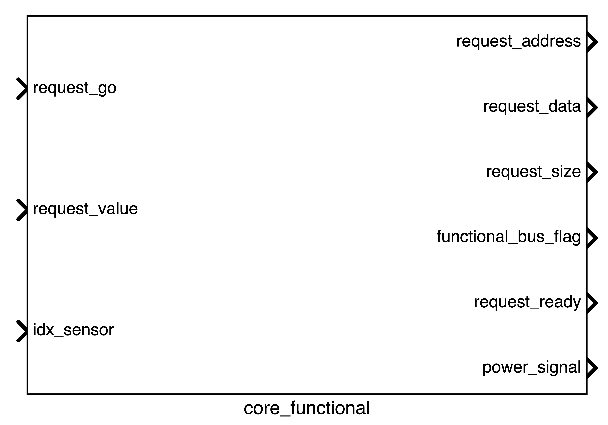

The core, alongside the [adapter] is probably the most important component of the whole system. Inside it contains all the necessary functions used to run the simulation. Inside it contains an instance of the `iss_adapter`.

Similarly to most of the other components, the core is composed of two separate instances:

- **Functional**: this instance is responsible for defining the internal characteristics of the core. This instance interfaces with the core through a bus
- **Power**: this instance controls the state of the core and exposes its current and voltage

## Functional Instance

The functional instance is as follows:

### Signals Summary

A summary of the signals is shown in the table below:

| Signal | Direction | Connected to | Description |
| --- | --- | --- | --- |
| request_go | input | Functional Bus | |
| request_value | input | Functional Bus | |
| idx_sensor | input | Functional Bus | |
| request_address | output | Functional Bus | |
| request_data | output | Functional Bus | |
| request_size | output | Functional Bus | |
| functional_bus_flag | output | Functional Bus | |
| request_ready | output | Functional Bus | |
| power_signal | output | Core Power| |

### Input Signals

The input signals are:

- **request_go**: 
- **request_value**:
- **idx_sensor**:

### Output Signals

The output signals are:

- **request_address**:
- **request_data**:
- **request_size**:
- **functional_bus_flag**:
- **request_ready**:
- **power_signal**:

Core makes a request by setting request_ready to true
Functional_bus processes the request
Functional_bus sets request_go to true when response data is ready
Core detects the request_go signal and reads the response data
Once Core finishes reading, Functional_bus sets request_go back to false