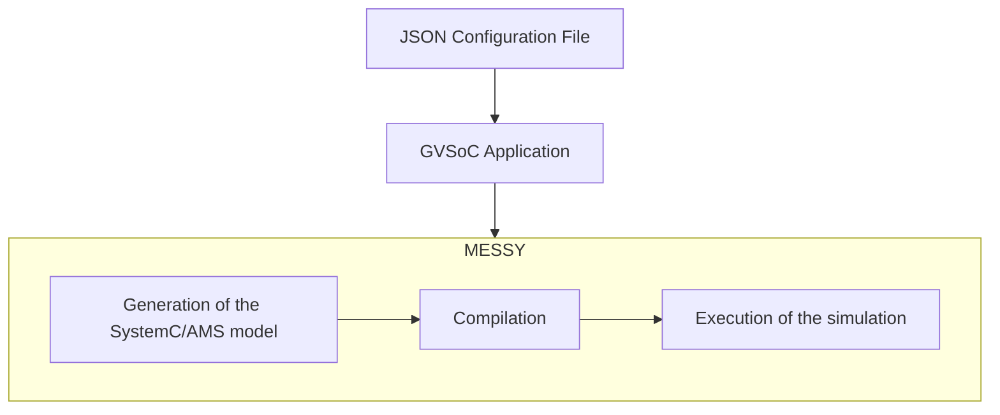

This file is intended for explaining the flow of MESSY and what each step does. The flow is divided into the following steps:

## Definition of the JSON configuration file

This step is crucial because it defines the whole system. The JSON configuration file allows the user to define the components, such as the [core](core.md), the [sensors](sensors.md), the [harvesters](harvesters.md), the [functional bus](functional-bus.md), the [power bus](power-bus.md) etc. 
All these blocks have a predifined structure in terms of input and output signals. However, the user can define for example the power consumption and the delay of each state of a [sensor](sensors.md).

## Writing the application that will run on GVSoC

This is another very important step because it defines the entrypoint of our simulation. Specifically it defines the code that will be executed by our system. The application is written in C. You can find some examples in the `examples` folder of the MESSY repository.

## Running the MESSY tool

The next step is to run the MESSY tool. The entrypoint is the `messy.py` script. This script expects two arguments:

- `-f`: the file name of the chosen JSON configuration file
- `-a`: the path of the folder of the application

This script will do the following:

1. [Generate the SystemC/SystemC-AMS model](#generation-of-the-systemcams-models)
2. [Compile the SystemC/SystemC-AMS model and the application](#compilation)
3. [Execute the simulation](#execution-of-the-simulation)

### Generation of the SystemC/AMS models

The first step of the MESSY tool is to generate the SystemC and SystemC-AMS. The components defined in the JSON should match the available components defined in the `messy/codegen/templates` folder. The latter contains all the templates of the components that are supported by MESSY.

As already mentioned, most of these templates have a predefined structure in terms of input and output signals. However, through the JSON configuration file, the user can define custom characteristics of the components, such as the power consumption and the delay of each state of a sensor.

The JSON is then parsed by the python script and the templates are filled with the necessary information and saved in the `messy/codegen/src` and `messy/codegen/include` folders respectively.

For more details on these steps, please refer to the [codegen](codegen.md) documentation.

### Compilation

The following step of the `messy.py` script is to compile both the GVSoC application and the SystemC/SystemC-AMS models. 

The GVSoC application is compiled using the Makefile command `make application`. Everything happens automatically, since the `messy.py` script launches a subprocess that executes the command. Following the compilation of the GVSoC application, the SystemC/SystemC-AMS models are compiled using the Makefile command `make run`. This command compiles the models and runs the simulation. Everything, as before, happens automatically, since the `messy.py` script launches a subprocess that executes the command.

### Execution of the simulation

The execution, as already explained, is done by the Makefile command `make run`. This command compiles the SystemC/SystemC-AMS models and runs the simulation.
