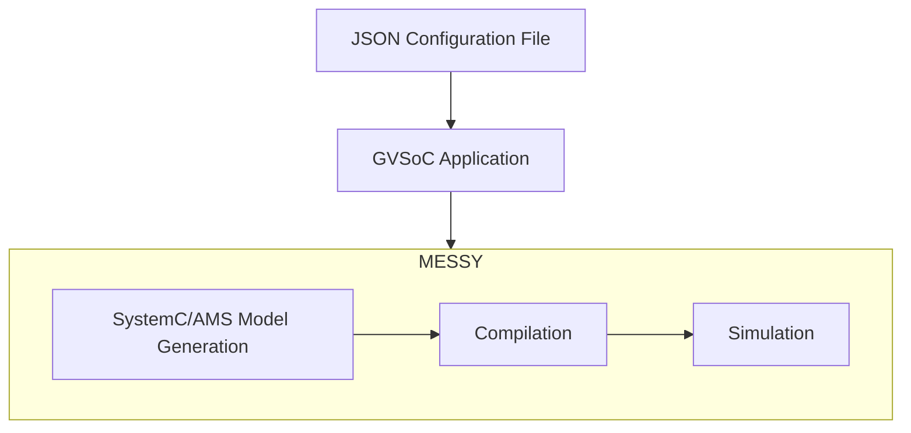

# MESSY Flow

This document explains the workflow of MESSY, from system definition to simulation.

## 1. System Definition (JSON)

The first step is to define the system using a JSON configuration file. This file describes the components of the system, such as the [core](core.md), [sensors](sensors.md), [harvesters](harvesters.md), [functional bus](functional-bus.md), and [power bus](power-bus.md). While the components have a predefined structure, the JSON file allows you to customize their parameters, such as power consumption and delays.

For more details on the JSON configuration, see the [Codegen](codegen.md) documentation.

## 2. Application Development

Next, you need to write the application that will run on the simulated RISC-V core. This application is written in C and defines the behavior of the system. You can find examples in the [examples](https://github.com/eml-eda/messy/tree/main/examples) folder of the MESSY repository.

## 3. Running the MESSY Tool

The `messy.py` script is the main entry point for running the simulation. It takes two arguments:

- `-f`: The path to the JSON configuration file.
- `-a`: The path to the application directory.

The script automates the following steps:

### a. SystemC/AMS Model Generation

MESSY parses the JSON configuration file and generates the corresponding SystemC/SystemC-AMS models. The generated code is placed in the `messy/codegen/src` and `messy/codegen/include` directories.

### b. Compilation

The script compiles both the user application and the generated SystemC/SystemC-AMS models. It uses `make` to build the application and the simulation environment.

### c. Simulation

Finally, the script runs the simulation. The simulation is executed, and the results are saved to the output files specified in the configuration.
