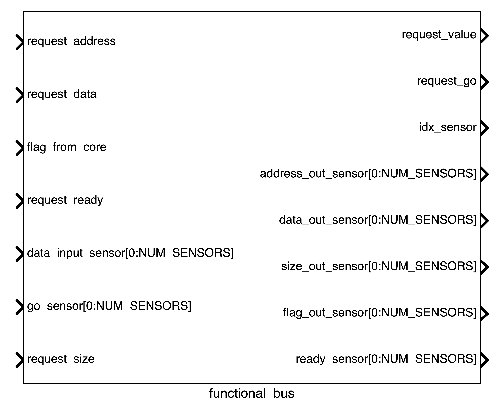

The functional bus is one of the most important component of the whole system. It is the "man in the middle" between the [core](core.md) and the [sensors](sensors.md). It is responsible for managing the requests from the core and forwarding them to the sensors. It is also responsible for managing the responses from the sensors and forwarding them to the core.

Differently from the other components, the functional bus does not have a dedicated power instance. The most similar thing to a power instance, is the [power bus](power-bus.md) that is used to exchange the power state of all the components of the system and forward it to the [harvesters](harvesters.md).

## Functional Bus Instance

The functional bus instance is as follows:

### Signals Summary

A summary of the signals is shown in the table below:

### Input Signals

The input signals are:

- **request_address**: This signal is an unsigned integer. It comes from the [core](core.md) and contains the offset of the sensor memory that is being accessed. For example, if the sensor memory is contains 256 bytes and the request_address is set to 10 it means that we are accessing the 10th byte of the sensor memory. If the request has a size greater than 1, the request address will be the starting address of the memory block of the sensor. 
Inside the functional bus, this signal is subtracted by the base address of the sensor memory and then forwarded to the sensor through the `address_out` signal. This substraction is important because it allows to manage the situation where there are multiple sensors with different memory addresses.
- **request_data**: This signal is a pointer. It comes from the [core](core.md) and contains the pointer to the data that is being written to the sensor memory. 
- **flag_from_core**: This signal is a boolean. It comes from the [core](core.md) and it used to indicate if the request is a read or a write. If the flag is set to true it means that the request is a read, otherwise it is a write. 
- **request_ready**: This signal is a boolean. It comes from the [core](core.md) and it is used to indicate that the request is ready to be processed by the functional bus. In the functional bus, in fact, the main loop is waiting for this signal to be set to true before forwarding the request to the sensor. This signal is in the sensitivity list of the main thread of the functional bus.
- **data_input_sensor[0:NUM_SENSORS]**: This signal a pointer. It comes from the [sensors](sensors.md) and contains the pointer to the data that has been read or written from the sensor memory.
- **go_sensor[0:NUM_SENSORS]**: this signal is a boolean. It comes from the [sensors](sensors.md) and it is used to signal that the sensor has completed the operation. It is set to `true` when the sensor has finished, to `false` otherwise. It is very important because it is in the sensitivity list of the main thread of the functional bus. This means that when there is a change in the go_sensor signal, the functional bus is woken up. 
- **request_size**: this signal is a unsigned integer. It comes from the [core](core.md) and contains the number of bytes that are being read from or written to the sensor memory. Inside the functional bus, this signal is forwarded to the [sensors](sensors.md) through the `size_out_sensor` signal.

### Output Signals

The output signals are:

- **request_value**: This signal is a pointer. It goes to the [core](core.md) and contains the pointer to the data written to the sensor memory or read from it. When the request is a write this value is ignored.
- **request_go**: This signal is a boolean. It goes to the [core](core.md). It is used to signal the core when a request is completed. Initially, request_go is set to 0, and it means that the request is being processed. When the request is completed, the functional bus sets the request go to 1. The [core](core.md) then wakes up and set the request_ready signal to 0. The functional bus then frees the sensor and sets the request_go to 0 again.
- **idx_sensor**: This signal is an integer. It goes to the [core](core.md) and contains the index of the sensor that is being accessed. This signal is used to manage the situation where there are multiple sensors with different memory addresses.
- **address_out_sensor[0:NUM_SENSORS]**: This signal is an unsigned integer. It goes to the [sensors](sensors.md) and contains the offset of the sensor memory that is being accessed. 
- **data_out_sensor[0:NUM_SENSORS]**: This signal is a pointer. It goes to the [sensors](sensors.md) and contains the pointer to the data that is being written to the sensor memory. In case of a read request, this value can be ignored.
- **size_out_sensor[0:NUM_SENSORS]**: This signal is an unsigned integer. It goes to the [sensors](sensors.md) and contains the number of bytes that are being read from or written to the sensor memory.
- **flag_out_sensor[0:NUM_SENSORS]**: This signal is a boolean. It goes to the [sensors](sensors.md) and it used to indicate if the request is a read or a write. If the flag is set to true it means that the request is a read, otherwise it is a write.
- **ready_sensor[0:NUM_SENSORS]**: This signal is a boolean. It goes to the [sensors](sensors.md)  and it is used to indicate that the request is ready to be processed by the [sensor](sensors.md). 

