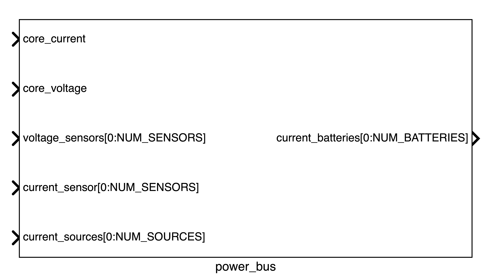

The power bus is another key component of MESSY. It is the bus where all power components are connected to. Its structure is as follows:



## Signals Summary

A summary of the signals is shown in the table below:

| Signal | Direction | Connected to | Description |
| --- | --- | --- | --- |
| core_current | input | Core Converter | Current |
| core_voltage | input | Core Converter | Voltage |
| voltage_sensor | input | Sensor Power | Voltage of the Sensor |
| sensor_current | input | Sensor Converter | Current |
| current_sources | input | Source Converter | Current |
| current_batteries | output | Battery Converter | Current |

## Input Signals

The input signals are:

- **core_current**: This signal is a double. It comes from the Core converter and it indicates the current cosumed from the Core.
- **core_voltage**: This signal is a double. It comes from the Power instance of the core and it indicates the voltage of the core.
- **voltage_sensor**: This signal is an array of doubles. Its size is equal to the number of sensors. It comes from the each sensor power instance and it indicates the voltage of the corresponding sensor.
- **sensor_current**: This signal is an array of doubles. Its size is equal to the number of sensors. It comes from the each sensor converter and it indicates the current consumed by the corresponding sensor.
- **current_sources**: This signal is an array of double. Its size is equal to the number of sources. It comes from the each source converter and it indicates the current provided by the corresponding source.

## Output Signals

The output signals are:

- **current_batteries**: This signal is an array of double. Its size is equal to the number of batteries. It contains the sum of all the contributions of the currents consumed/produced by each sensor/source divided by the number of batteries. The code looks something like this:

```cpp
void Power_bus::processing() {
    double tmp_i;
    total_current = 0;

    for (int i = 0; i < NUM_SENSORS; i++) {
        tmp_i = current_sensors[i].read();
        total_current += tmp_i; //(1)!
    }

    tmp_i = core_current.read();

    total_current += tmp_i; //(2)!

#if NUM_SOURCES > 0
    for (int i = 0; i < NUM_SOURCES; i++) {
        tmp_i = current_sources[i].read();
        total_current -= tmp_i; //(3)!
    }
#endif

#if NUM_BATTERIES > 0
    for (int i = 0; i < NUM_BATTERIES; i++)
        current_batteries[i].write(total_current / NUM_BATTERIES); //(4)!
#endif
}
```

1. Sum all the current contributions from the sensors
2. Add the current from the core
3. Subtract from the total current the current provided by each source
4. Write the total current divided by the number of batteries to each battery converter


## Definition in the JSON file


