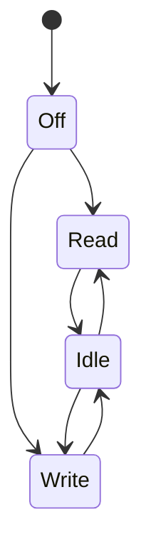

# Sensors

Sensors are crucial components in the MESSY framework, enabling the simulation of interactions between the virtual system and the physical world. Each sensor is comprised of two distinct instances:

- **Functional Instance**: This instance defines the internal characteristics and behavior of the sensor, interfacing with the core through a bus.
- **Power Instance**: This instance manages the sensor's power states, exposing its current and voltage to the power bus.

## Functional Instance

The functional instance is a SystemC module that models the sensor's behavior. It communicates with the [Functional Bus](functional-bus.md) to read and write data.


### Signals Summary

| Signal | Direction | Connected to | Description |
| --- | --- | --- | --- |
| `enable` | input | - | Enables or disables the sensor. |
| `address` | input | Functional bus | Address of the register to read from or write to. |
| `data_in` | input | Functional bus | Pointer to the input data for write operations. |
| `req_size` | input | Functional bus | Size of the data to be read or written. |
| `flag_wr` | input | Functional bus | A flag to determine the operation type: `true` for read, `false` for write. |
| `ready` | input | Functional bus | A flag indicating that the sensor is ready for a new operation. |
| `data_out` | output | Functional bus | Pointer to the output data for read operations. |
| `go` | output | Functional bus | A signal indicating the completion of an operation. |
| `power_signal` | output | Power bus | The current power state of the sensor. |

### Input Signals
The input signals are:

- **enable**: this signal is used to enable the sensors. If the sensor is enable it will execute read or write operations and it will set the power state accordingly. Otherwise, the sensor is in a state that consumes 0 power.

    ``` c++
    if (enable.read() == true) {
        // read or write operations
    } else {
        power_signal.write(0); // (1)!
    }
    ```
    
    1. If the sensor is disabled, it will consume 0 power.

- **address**: This signal is used to select the register of the sensor to read or write. For example, this is the code when reading:

    ``` c++
    unsigned int add = address.read(); // (1)!

    data_out.write(register_memory + add); // (2)!
    ```
    
    1. Read the address from the bus
    2. Write to the output bus the pointer of the memory of the sensor at address `add`.

- **data_in**: This signal represents the **pointer** to the input data. This is done in order to allow the possibility of passing multiple data to the sensor
- **req_size**: This signal is used to define the size of the data that the sensor is going to read or write.
- **flag_wr**: This signal is used to define if the sensor is going to read or write. If the signal is true, the sensor is going to write, otherwise it is going to read.
- **ready**: This signal is used to define if the sensor is ready to read or write. 

### Output Signals

- **data_out**: This signal represents the **pointer** to the output data. This signal goes to the [functional bus](functional-bus.md)
- **go**: This signal is used to signal that the sensor has completed the operation. It is set to `true` when the sensor has finished, to `false` otherwise. This signal goes to the [functional bus](functional-bus.md)
- **power_signal**: This signal represents the power state of the sensor. It is connected to the power instance of the sensor

## Power Instance

The power instance is a SystemC-AMS module that models the power consumption of the sensor. It receives the power state from the functional instance and calculates the corresponding voltage and current consumption.


### Signals Summary

| Signal | Direction | Connected to | Description |
| --- | --- | --- | --- |
| `func_signal` | input | Sensor Functional | The power state of the sensor. |
| `voltage_state` | output | Power bus & Load Converter | The voltage of the sensor. |
| `current_state` | output | Power bus | The current drawn by the sensor. |

### Input Signals

- **`func_signal`**: An integer representing the power state of the sensor, received from the functional instance.

### Output Signals

- **`voltage_state`**: The voltage of the sensor.
- **`current_state`**: The current drawn by the sensor.

## JSON Configuration

Sensors are defined in the `peripherals.sensors` section of the JSON configuration file. Here is an example of a microphone sensor:

```json
"mic_click": {
    "vref": 3.3,
    "register_memory": 256,
    "states": {
        "read": {
            "current": "0.12",
            "delay": "30"
        },
        "write": {
            "current": "0.16",
            "delay": "30"
        },
        "idle": {
            "current": "0.002"
        }
    }
}
```

- **`vref`**: The reference voltage of the sensor in Volts.
- **`register_memory`**: The size of the sensor's memory in bytes.
- **`states`**: Defines the different power states of the sensor. Each state has a `current` consumption in mA and an optional `delay` in ms.

## Custom Sensors

Currently, default sensors should only be used as placeholders in simple projects, since they do not implement any specific logic. For specialized behavior, you can implement custom sensors by setting `"type": "custom"`:

```json
"gesture": {
    "type": "custom",
    "custom_implementation": {
        "path_header": "./gesture_sensor/gesture_sensor.hpp",
        "path_source": "./gesture_sensor/gesture_sensor.cpp"
    },
    "vref": 3.3,
    "register_memory": 1024,
    "states": { /* same as default sensors */ }
}
```

**Requirements**: Custom sensors must maintain the exact same interface as default sensors (same ports, class name pattern, constructor). Only the `sensor_logic()` method implementation can be customized.

**Files**: Place header and source files in the `templates/custom/` directory.

## State Machine

The sensor's behavior is modeled as a state machine:



## Memory Mapping

Sensors are mapped to a specific memory region. The `baseaddress` of each sensor is automatically calculated by the `codegen.py` script based on the order of the sensors in the JSON file and the size of their `register_memory`.

The `codegen.py` script calculates the base address for each sensor as follows:

```python
for idx,(sensor_name,sensor) in enumerate(settings["peripherals"]["sensors"].items()):
    sensor["base"] = baseaddress
    sensor["ID"] = idx
    baseaddress += 1 + sensor["register_memory"]
```

This loops over all the sensors in the JSON configuration file and assign the `baseaddress` to that sensor. For this reason, if we want one sensor before the other in the memory, is importan to define them correctly. The `baseaddress` is not to be confused with the `AXI_BASE`. In fact, GVSoC has some memory space that is fixed and cannot be touched, otherwise it causes segmantation faults. After that memory space, there is available memory space where the user can write whatever is needed.

```c
...
#define AXI_BASE 0x20000000
...
int main(void)
{
    ...

    int* mic_click_sensor = (volatile int *)AXI_BASE+0x0;
    ...
}
```

As we can see in the code example (taken from the `periodic_sensors.c`), to define the address of the `mic_click_sensor` we just need to add `0x0` to the `AXI_BASE_ADDRESS`. This is because the used configuration for this example, which is the `pulp_open.json`, only contains one sensor. For more details on the example refer to the [periodic sensor](examples/periodic-sensor.md) page.

Supposing we have two sensors with a `register_memory` of 256 (0x100 in hexadecimal) and we want to access the memory of the second one, we should add to `AXI_BASE` the offset (which is 256, 0x100 in hexadecimal) with the respect to the starting address. 

| Name | Base Address | Memory Register Size | Offset w.r.t AXI_BASE |
| ----| ----| ----|----|
| AXI_BASE| 0x20000000 |-| 0|
| sensor1| 0x20000000|0x100| 0|
| sensor2 |0x20000100|0x100| 0x100|