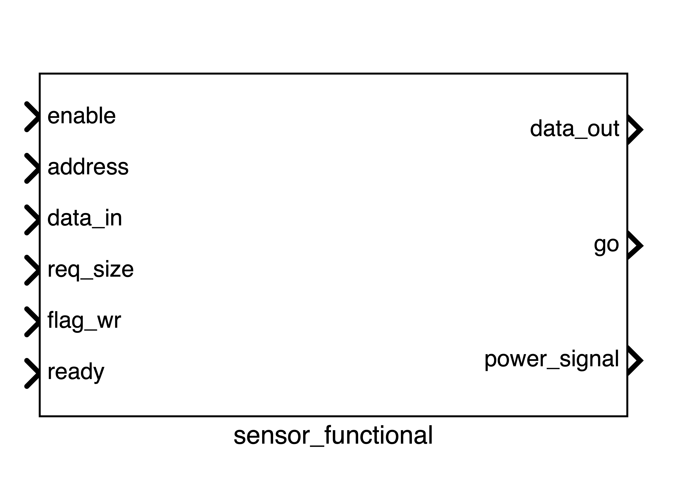
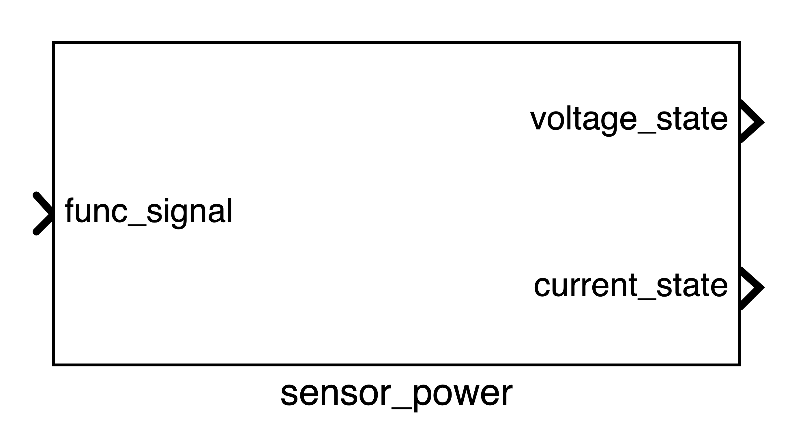
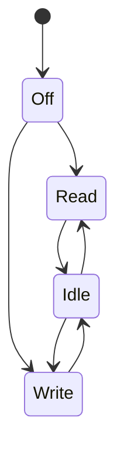

# Sensors

Sensors are important components for this simulator. Every sensor can be composed by two separate instances:

- **Functional**: this instance is responsible for define the internal characteristics of the sensor. This instance interfaces with the core through a bus
- **Power**: this instance controls the state of the sensor and exposes its current and voltage

## Functional Instance
The functional instance is as follows: 



### Signals Summary
A summary of the signals is shown in the table below:

| Signal | Direction | Connected to | Description |
| --- | --- | --- | --- |
| enable | input |  | Enable the sensor |
| address | input | Functional bus | Address of the register to read or write |
| data_in | input | Functional bus | Pointer to the input data |
| req_size | input | Functional bus | Size of the data to read or write |
| flag_wr | input | Functional bus | Flag to define if the sensor is going to read or write |
| ready | input | Functional bus | Flag to define if the sensor is ready to read or write |
| data_out | output | Functional bus | Pointer to the output data |
| go | output | Functional bus | Signal that the sensor has completed the operation |
| power_signal | output | Power bus | Power state of the sensor |

### Input Signals
The input signals are:

- **enable**: this signal is used to enable the sensors. If the sensor is enable it will execute read or write operations and it will set the power state accordingly. Otherwise, the sensor is in a state that consumes 0 power.

    ``` c++
    if (enable.read() == true) {
        // read or write operations
    } else {
        power_signal.write(0); // (1)!
    }
    ```
    
    1. If the sensor is disabled, it will consume 0 power.

- **address**: This signal is used to select the register of the sensor to read or write. For example, this is the code when reading:

    ``` c++
    unsigned int add = address.read(); // (1)!

    data_out.write(register_memory + add); // (2)!
    ```
    
    1. Read the address from the bus
    2. Write to the output bus the pointer of the memory of the sensor at address `add`.

- **data_in**: This signal represents the **pointer** to the input data. This is done in order to allow the possibility of passing multiple data to the sensor
- **req_size**: This signal is used to define the size of the data that the sensor is going to read or write.
- **flag_wr**: This signal is used to define if the sensor is going to read or write. If the signal is true, the sensor is going to write, otherwise it is going to read.
- **ready**: This signal is used to define if the sensor is ready to read or write. 

### Output Signals
The output signals are:

- **data_out**: This signal represents the **pointer** to the output data. This signal goes to the [functional bus](functional-bus.md)
- **go**: This signal is used to signal that the sensor has completed the operation. It is set to `true` when the sensor has finished, to `false` otherwise. This signal goes to the [functional bus](functional-bus.md)
- **power_signal**: This signal represents the power state of the sensor. It is connected to the power instance of the sensor

## Power Instance

The functional instance is a SystemC-AMS Module and is structured as follows: 



### Signals Summary
A summary of the signals is shown in the table below:

| Signal | Direction | Connected to | Description |
| --- | --- | --- | --- |
| func_signal | input | Sensor Functional | Power state of the sensor |
| voltage_state | output | Power bus & Load Converter | Voltage of the sensor |
| current_state | output | Power bus | Current of the sensor |

### Input Signals

The input signals are:

- **func_signal**: This signal is used to define the power state of the sensor. It is usually an integer, representing a value from an enum. This signal comes from the functional instance of the sensor.

### Output Signals
The output signals are:

- **voltage_state**: This signal is used to define the voltage of the sensor. This signal is connected to the power bus and the load converter
- **current_state**: This signal is used to define the current of the sensor. This signal is connected to the power bus

## Definition in the JSON Configuration File

The sensors are defined together with the rest of the system in a JSON configuration file. Below for example there is defined a microphone sensor called `mic_click`:

```JSON
"mic_click": {
    "tracing":{
        "messy_trace":{
            "mic_click_I":"current"
        }
    },
    "vref": 3.3,
    "register_memory" : 256,
    "states":{
        "read" : {
            "current" : "0.12",
            "delay" : "30"
        },
        "write": {
            "current" : "0.16",
            "delay" : "30"
        },
        "idle":{
            "current" : "0.002"
        }
    }
}
```

Each sensor needs a certain amount of memory to interact with the system and this is simulated and setted thanks to the `register_memory` parameter. 

Ideally each sensor could define a set of states, however currently the system supports only the reading state, the writing state and an idle state. 

Each state is defined considering the needed `current`, in mA, and optionally a timing `delay` in ms (how much time the sensor stay in that state).

Tracing can be set as described in [Tracing](tracing.md).

Finally, the information about the reference voltage can be set through the `vref` parameter.

## State Machine

The state machine of the sensor can be represented as follows:



## Sensor Memory & Multiple Sensors

As we previously described, there is a field called `register_memory`. This takes into account the memory space of the sensor. This is managed by the following lines of code in the `codegen.py`:

```python
for idx,(sensor_name,sensor) in enumerate(settings["peripherals"]["sensors"].items()):
    sensor["base"] = baseaddress
    sensor["ID"] = idx
    baseaddress += 1 + sensor["register_memory"]
```

This loops over all the sensors in the JSON configuration file and assign the `baseaddress` to that sensor. For this reason, if we want one sensor before the other in the memory, is importan to define them correctly. The `baseaddress` is not to be confused with the `AXI_BASE`. In fact, GVSoC has some memory space that is fixed and cannot be touched, otherwise it causes segmantation faults. After that memory space, there is available memory space where the user can write whatever is needed.

```c
...
#define AXI_BASE 0x20000000
...
int main(void)
{
    ...

    int* mic_click_sensor = (volatile int *)AXI_BASE+0x0;
    ...
}
```

As we can see in the code example (taken from the `periodic_sensors.c`), to define the address of the `mic_click_sensor` we just need to add `0x0` to the `AXI_BASE_ADDRESS`. This is because the used configuration for this example, which is the `pulp_open.json`, only contains one sensor. For more details on the example refer to the [periodic sensor](periodic-sensor.md) page.

Supposing we have two sensors with a `register_memory` of 256 (0x100 in hexadecimal) and we want to access the memory of the second one, we should add to `AXI_BASE` the offset (which is 256, 0x100 in hexadecimal) with the respect to the starting address. 

| Name | Base Address | Memory Register Size | Offset w.r.t AXI_BASE |
| ----| ----| ----|----|
| AXI_BASE| 0x20000000 |-| 0|
| sensor1| 0x20000000|0x100| 0|
| sensor2 |0x20000100|0x100| 0x100|