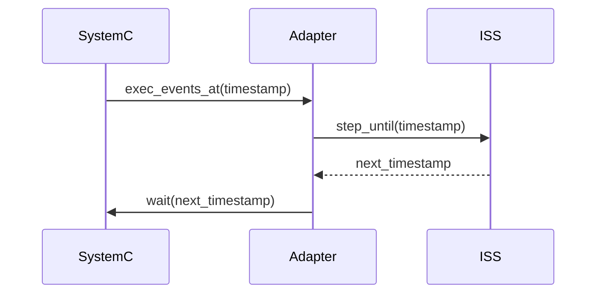

This file is intended to describe how the timing between SystemC and GvSoC works. This is very important to understand, since it allows to grasp all the details about the communication between the two worlds. Everything mainly happens in the `core.cpp` and in the respective adapter (in this case `adapter_gvsoc.cpp`). The whole communication process is made possible thanks to some API that the chosen ISS (i.e GvSoC) exposes. Particularly the `step_until()` function is what actually advances the simulation inside GvSoc. This function executes the SoC functionality and returns the timestamp of the following event in the GVSoC queue. 

This function, has been wrapped in the `adapter_gvsoc.cpp` into a function called `exec_events_at(timestamp)`, which simply calls the `step_until()` function and returns the timestamp of the following event of the SoC ([https://github.com/eml-eda/messy/blob/main/messy/codegen/templates/src/adapters/adapter_gvsoc.cpp#L55-L57](https://github.com/eml-eda/messy/blob/main/messy/codegen/templates/src/adapters/adapter_gvsoc.cpp#L55-L57))

In the case you want to add a new ISS, you should implement the `exec_events_at(timestamp)` function in the respective adapter. This function should call a functionally equivalent method of the ISS you are using.

The simulation advances in the following way:

1. Given the current SystemC timestamp, the `exec_events_at(timestamp)` function is called. This function advances the simulation in the ISS until the timestamp given as argument and returns the timestamp of the following event, that is called `next_timestamp`.
2. The `next_timestamp` is then used to advance the SystemC simulation until that timestamp. This is done by calling the `wait()` function of the SystemC kernel. 
3. This process is repeated until the simulation ends.

A view of the sequence diagram of the timing between SystemC and GvSoC is shown below:

